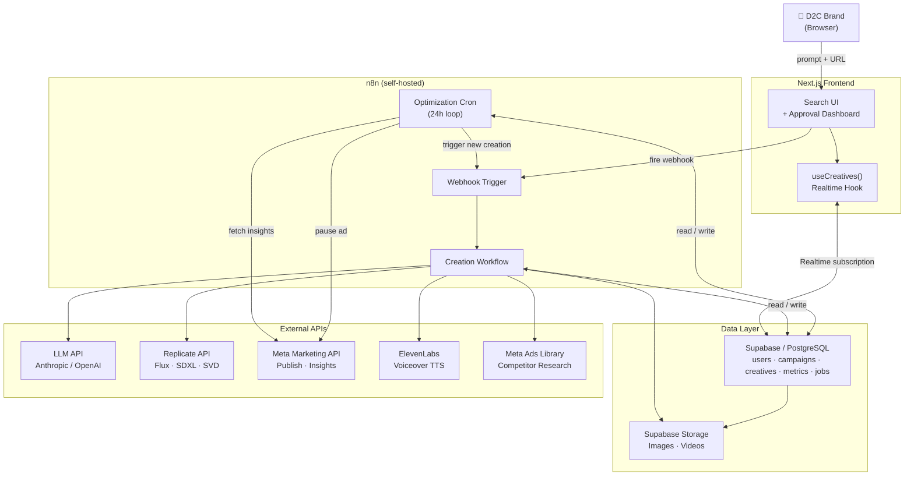
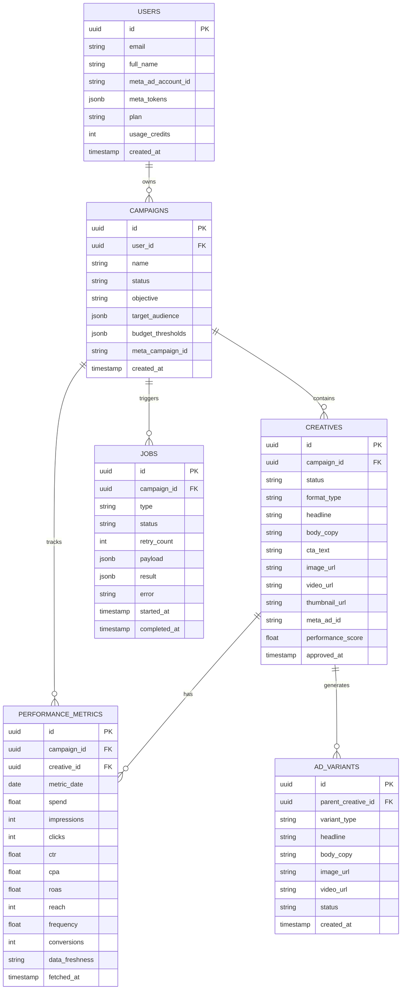
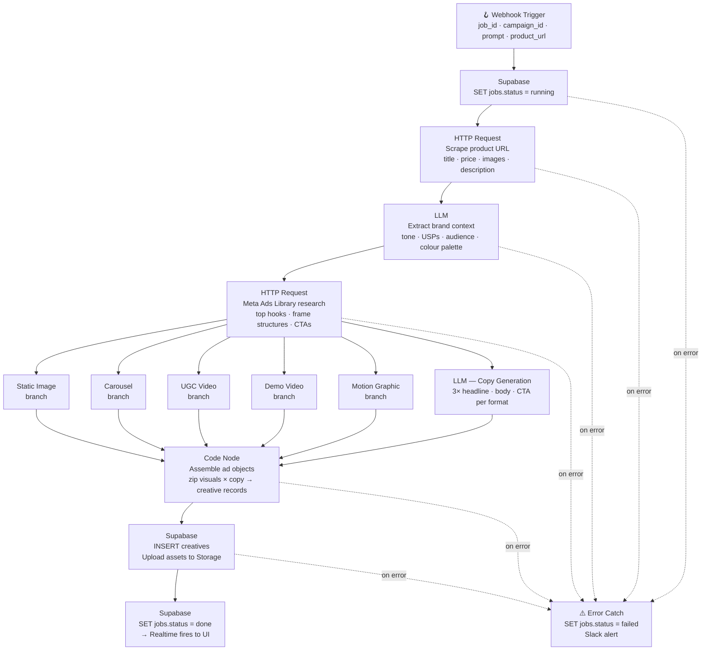
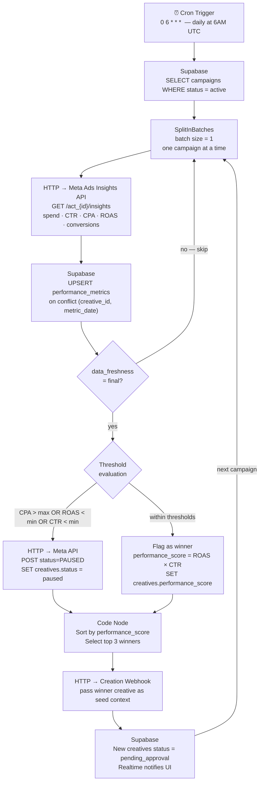
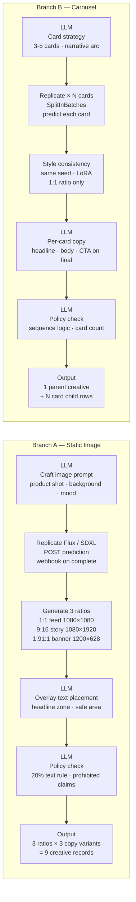
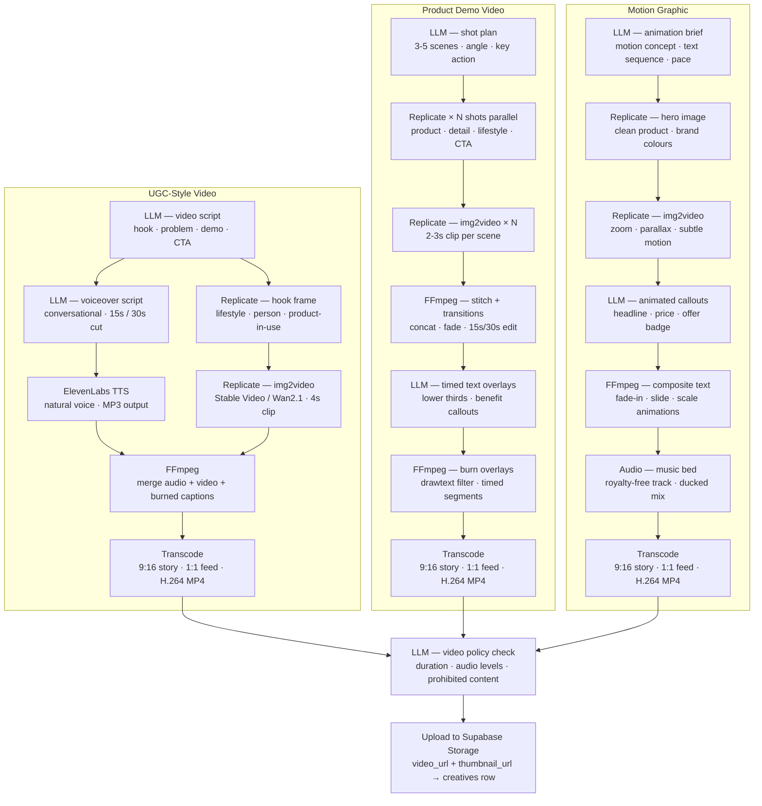

# Adverto — Autonomous Ad Generation & Optimization Platform

> **Replace your creative agency.** Adverto is a SaaS platform that autonomously generates, publishes, and optimizes Meta ad creatives for D2C brands using AI — no designer required.

---

## Table of Contents

1. [Vision](#vision)
2. [Tech Stack](#tech-stack)
3. [System Architecture](#system-architecture)
4. [Database Schema](#database-schema)
5. [n8n Workflow Blueprints](#n8n-workflow-blueprints)
   - [Workflow 1 — Creation](#workflow-1--creation-workflow)
   - [Workflow 2 — Optimization Loop](#workflow-2--24h-optimization-loop)
6. [Ad Format Pipelines](#ad-format-pipelines)
   - [Image Formats](#image-formats-static--carousel)
   - [Video Formats](#video-formats-ugc--demo--motion-graphic)
7. [MVP Development Roadmap](#mvp-development-roadmap)
8. [Risk Mitigation](#risk-mitigation)
9. [Key Architectural Decisions](#key-architectural-decisions)
10. [Resources & Links](#resources--links)

---

## Vision

Adverto gives D2C brands a **Google Search-style interface**: enter your campaign brief and drop a product URL on the left — a live-updating grid of AI-generated ad creatives appears on the right. Behind the scenes, a 24-hour optimization loop watches live Meta performance data, automatically pauses losing ads, and generates fresh variants from winners — surfacing them for one-click human approval before publishing.

```
┌──────────────────────────────────────────────────────────┐
│  "Running shoes for marathon training, budget $50"       │
│  https://mystore.com/product/ultrarunner-pro      [→]    │
├──────────────────┬───────────────────────────────────────┤
│                  │  ┌─────────┐ ┌─────────┐ ┌─────────┐ │
│  Campaign        │  │ Static  │ │Carousel │ │  Video  │ │
│  Settings        │  │  Ad     │ │  Ad     │ │  UGC    │ │
│                  │  │ ✓ Appr. │ │ pending │ │ pending │ │
│  Thresholds      │  └─────────┘ └─────────┘ └─────────┘ │
│  max CPA: $15    │  ┌─────────┐ ┌─────────┐             │
│  min ROAS: 2.5x  │  │  Demo   │ │ Motion  │             │
│  min CTR: 0.8%   │  │  Video  │ │ Graphic │             │
│                  │  │ pending │ │ pending │             │
└──────────────────┴───────────────────────────────────────┘
```

---

## Tech Stack

| Layer | Technology | Purpose |
|---|---|---|
| Frontend | [Next.js 14](https://nextjs.org/) | App router, server components, real-time UI |
| Database | [Supabase](https://supabase.com/) / PostgreSQL | Auth, data, storage, realtime subscriptions |
| Orchestration | [n8n](https://n8n.io/) (self-hosted) | Workflow automation, cron jobs, API glue |
| Image / Video Gen | [Replicate API](https://replicate.com/) | Flux, SDXL, Stable Video Diffusion, Wan2.1 |
| Copy & Logic | [Anthropic API](https://www.anthropic.com/api) / [OpenAI API](https://platform.openai.com/) | Script writing, brand extraction, policy check |
| Voiceover | [ElevenLabs API](https://elevenlabs.io/) | TTS for UGC-style video ads |
| Ad Platform | [Meta Marketing API](https://developers.facebook.com/docs/marketing-apis/) | Publish ads, fetch performance insights |
| Video Processing | [FFmpeg](https://ffmpeg.org/) | Concat, captions, text overlays, transcoding |
| Payments | [Stripe](https://stripe.com/) | Subscription billing, usage metering |
| Error Monitoring | [Sentry](https://sentry.io/) | Error tracking across Next.js and n8n |

---

## System Architecture

> **Core principle:** Supabase is the single source of truth. n8n is the async brain. Next.js never calls external APIs directly — it writes intent and subscribes to results.



### Data flow lifecycle

1. User submits prompt → Next.js API route fires webhook to n8n
2. n8n creates a `jobs` record (`status = running`) in Supabase
3. n8n orchestrates external APIs in parallel (LLM + Replicate + TTS)
4. n8n writes finished assets to Supabase Storage and inserts `creatives` rows
5. n8n marks `jobs.status = done`
6. Supabase Realtime pushes update to Next.js → creative cards appear in the grid
7. User approves → Next.js triggers n8n publish workflow → Meta API

---

## Database Schema



### Schema design decisions

#### `campaigns.budget_thresholds` (JSONB)
```json
{
  "max_cpa": 15.00,
  "min_roas": 2.5,
  "min_ctr": 0.008,
  "min_spend_before_eval": 50.00
}
```
The `min_spend_before_eval` gate is critical — never pause an ad on $2 of spend.

#### `campaigns.target_audience` (JSONB)
```json
{
  "age_min": 25,
  "age_max": 45,
  "genders": [1, 2],
  "interests": ["fitness", "wellness"],
  "geo": ["US", "CA"]
}
```

#### `creatives.status` lifecycle
```
generating → pending_approval → approved → publishing → published → paused
```

#### `creatives.format_type` values
```
static_image | carousel | ugc_video | demo_video | motion_graphic
```

#### `performance_metrics.data_freshness`
Meta marks Insights data as `estimated` for 24–48 hours before finalizing. Only act on `final` data in the optimization loop — never pause an ad on estimated ROAS.

#### `jobs.retry_count`
On failure, n8n's error handler increments this and re-queues if `retry_count < 3`. After 3 failures → `status = failed_permanently` → alert user.

### Row-level security

```sql
-- Users see only their own campaigns
CREATE POLICY "users see own campaigns"
ON campaigns FOR ALL
USING (user_id = auth.uid());

-- Creatives scoped through campaign ownership
CREATE POLICY "users see own creatives"
ON creatives FOR ALL
USING (
  campaign_id IN (
    SELECT id FROM campaigns WHERE user_id = auth.uid()
  )
);
```

Apply the same indirect ownership pattern to `ad_variants`, `performance_metrics`, and `jobs`. n8n uses the **service role key** (bypasses RLS) — never expose it to the browser.

### Recommended indexes

```sql
CREATE INDEX ON campaigns (user_id);
CREATE INDEX ON creatives (campaign_id, status);
CREATE INDEX ON performance_metrics (creative_id, metric_date DESC);
CREATE INDEX ON jobs (campaign_id, status, created_at DESC);
```

### Realtime configuration

Enable only on tables the UI subscribes to:

```sql
ALTER PUBLICATION supabase_realtime ADD TABLE creatives;
ALTER PUBLICATION supabase_realtime ADD TABLE jobs;
```

---

## n8n Workflow Blueprints

### Workflow 1 — Creation Workflow

Triggered by webhook from Next.js. Generates all ad format types in parallel.



#### Critical implementation notes

**Fire-and-forget pattern:** Next.js fires the webhook and gets `200 OK` immediately. n8n creates the job record, returns a response, then continues processing asynchronously. The UI learns about results only through Supabase Realtime — never through a waiting HTTP response.

**Replicate webhook pattern (use this, not polling):**
```json
POST https://api.replicate.com/v1/predictions
{
  "version": "...",
  "input": { "prompt": "..." },
  "webhook": "https://your-n8n.com/webhook/replicate-done",
  "webhook_events_filter": ["completed"]
}
```
Replicate POSTs back to your n8n webhook when done. Store the `prediction_id` in `jobs.payload` so you can resume the correct workflow execution.

**Parallel LLM + Replicate branches** are essential for latency. Running them sequentially adds 60–90s per creative set.

---

### Workflow 2 — 24h Optimization Loop

Cron job that runs daily, evaluates all active campaigns against user-defined thresholds, pauses losers, identifies winners, and triggers new creation.



#### Key decisions

- **`SplitInBatches` (size 1)** prevents hammering Meta's API with parallel requests across many campaigns
- **`min_spend_before_eval`** gate: `IF spend < threshold → skip evaluation` — don't pause a new ad on insufficient data
- **Winner seed context** passed to creation webhook:
```json
{
  "seed_creative_id": "uuid",
  "winning_headline": "...",
  "winning_image_style": "...",
  "performance_score": 4.2,
  "mutation_target": "headline"
}
```
- **`variant_type`** in `ad_variants` tracks what was mutated: `headline | image | body_copy | full` — enables proper attribution in later analysis

---

## Ad Format Pipelines

### Image Formats: Static & Carousel



**Static image tip:** Use Node.js `sharp` to resize one Replicate output to all three dimensions rather than running three separate predictions — 3× cheaper and faster.

**Carousel tip:** Visual consistency across cards is the hardest challenge. Lock the same seed value and append an identical style suffix to every card prompt. For production quality, fine-tune a LoRA on the brand's product images.

---

### Video Formats: UGC, Demo & Motion Graphic



#### Format notes

| Format | Generation time | Compute cost | Best for |
|---|---|---|---|
| Static image | ~30–60s | Low | Always-on brand ads, retargeting |
| Carousel | ~2–4 min | Medium | Product showcases, feature walkthroughs |
| UGC video | ~4–6 min | High | Cold audience top-of-funnel |
| Demo video | ~6–10 min | Very high | Consideration phase, how-it-works |
| Motion graphic | ~3–5 min | Medium | Offers, promotions, launches |

**FFmpeg** runs in an n8n `Execute Command` node on your self-hosted instance. Core operations:

```bash
# Stitch clips with crossfade
ffmpeg -i clip1.mp4 -i clip2.mp4 -filter_complex \
  "[0][1]xfade=transition=fade:duration=0.3:offset=2.7" output.mp4

# Burn captions
ffmpeg -i input.mp4 -vf \
  "drawtext=text='Buy now':fontsize=48:x=(w-text_w)/2:y=h*0.85" output.mp4

# Transcode to Meta spec
ffmpeg -i input.mp4 -c:v libx264 -crf 23 -c:a aac -b:a 128k output.mp4
```

---

## MVP Development Roadmap

### Phase 1 — Infrastructure & skeleton (weeks 1–2)

**Backend**
- [x] Supabase project + all 6 tables with RLS policies
- [x] Enable Realtime publication on `creatives` + `jobs`
- [x] Supabase Storage bucket for ad assets (`ad-assets/`)
- [x] n8n connect(https://n8n-silver.flammelabs.com) with PostgreSQL backend (not SQLite)

**Frontend**
- [x] Next.js 14 app with Supabase Auth (Google OAuth)
- [x] Two-column layout: input right, grid left
- [x] Static mock creatives in the grid
- [x] `useCreatives()` hook with Supabase Realtime subscription

**Exit criteria:** user can sign in, see the two-column UI, Realtime subscription fires in DevTools

---

### Phase 2 — Creation workflow (weeks 3–4)

**n8n**
- [ ] Build creation workflow end-to-end (static image only first)
- [ ] LLM prompt: product data → 3 copy variants (JSON output)
- [ ] Replicate Flux: prompt → image + webhook-based completion
- [ ] Assemble + write creatives to Supabase

**Frontend**
- [ ] Input form fires POST to Next.js API route → webhook to n8n
- [ ] Creative card component (image + headline + body + CTA)
- [ ] Loading skeleton while job runs (poll `jobs` table)
- [ ] Approve / reject buttons per card

**Exit criteria:** user enters prompt, 3 creatives appear live in the grid within ~90s, user can approve one

---

### Phase 3 — Meta Ads integration (weeks 5–7)

**n8n + Meta**
- [ ] Meta OAuth flow + long-lived token storage in Supabase Vault
- [ ] Two-step publish: upload image asset → create ad
- [ ] Build 24h cron optimization loop
- [ ] IF threshold logic gate (CPA / ROAS / CTR)
- [ ] Auto-pause underperforming ads
- [ ] Re-trigger creation from winning seed

**Frontend**
- [ ] Campaign settings panel (threshold sliders)
- [ ] Performance metrics table per creative
- [ ] Publish button → triggers Meta upload
- [ ] Optimization history log

**Exit criteria:** approved ad publishes to Meta, optimization loop pauses a test ad, new variant appears for approval

---

### Phase 4 — Video formats + polish (weeks 8–12)

- [ ] Carousel image generation (multi-card, style consistency)
- [ ] UGC video pipeline (ElevenLabs + Replicate img2video + FFmpeg)
- [ ] Motion graphic pipeline
- [ ] Product demo video pipeline
- [ ] Stripe billing + usage metering (creatives generated per month)
- [ ] Rate limit handling + retry queues for all external APIs
- [ ] Meta Ads Library competitor research (node 4 in creation workflow)
- [ ] Email notifications (approval queue, alerts, optimization report)
- [ ] Error monitoring with Sentry
- [ ] Onboarding flow + Meta account connection wizard
- [ ] Staging environment + end-to-end smoke test suite

**Exit criteria:** first paying customer completes the full loop end-to-end without manual intervention

---

## Risk Mitigation

### Meta Ads API

| Risk | Mitigation |
|---|---|
| App review takes 2–4 weeks for `ads_management` permission | Submit Day 1. Use development mode against your own ad account immediately — no waiting |
| Rate limit: 200 calls/hour at Marketing API Tier 1 | Use the [batch endpoint](https://developers.facebook.com/docs/graph-api/batch-requests/) — 50 calls = 1 rate limit unit |
| Access token expires every 60 days | Store token + expiry in Supabase Vault; n8n cron refreshes 7 days before expiry |
| Image upload is a separate step from ad creation | Two-step publish: `POST /adimages` → get `image_hash` → `POST /ads` |
| Ads Library API is keyword-only, no category browse | Mock competitor research with a curated dataset in Phase 1; add real API calls in Phase 4 |
| User deletes Meta access mid-campaign | n8n error handler catches 401/403, marks campaign `disconnected`, surfaces re-auth banner |

### Replicate API

| Risk | Mitigation |
|---|---|
| Cold-start latency: 30–90s if model is not warm | Use Replicate webhook callbacks — don't poll. Store `prediction_id` in `jobs.payload` to resume |
| n8n HTTP node default timeout is 30s — too short | Set timeout to 300s on Replicate nodes; better yet, use the webhook pattern entirely |
| Predictions can fail silently | Wrap in error handler; check `status === "failed"` on webhook callback and retry |
| No SLA on Starter tier | Keep SDXL/Flux model warm with a lightweight no-op ping every 15 min (small cost, ~60s latency savings) |

### n8n

| Risk | Mitigation |
|---|---|
| Webhook execution has a 240s wall-clock timeout | **Fire-and-forget pattern:** webhook → write job to Supabase → return `200` immediately → separate n8n trigger workflow picks up the job |
| No built-in dead-letter queue | Error catch node on every workflow → Supabase update + Slack alert |
| Self-hosted n8n loses state on restart | Use PostgreSQL-backed n8n (set `DB_TYPE=postgresdb`), not SQLite. Mount persistent volume on Railway |
| Concurrent workflows saturate queue | Set `EXECUTIONS_PROCESS=main` + Redis-backed queue (`QUEUE_BULL_REDIS_HOST`) when scaling |

### General

| Risk | Mitigation |
|---|---|
| LLM cost blowout | Use `claude-haiku` or `gpt-4o-mini` for copy variants. Reserve expensive models for strategy/research steps only. Cap `max_tokens` per call |
| Meta ad policy rejection post-publish | Add an LLM policy-check step before every publish: prohibited claims, 20% text rule, before/after imagery ban |
| Supabase Realtime connection drops | Implement reconnect logic in `useCreatives()`; fall back to 10s polling if socket down >30s |
| Image generation produces off-brand results | Include brand hex colours, typography preferences, and product photography style in every Replicate prompt |
| Video generation at scale | Queue video jobs separately with lower concurrency limits; show per-step progress updates via `jobs.payload` writes |

---

## Key Architectural Decisions

### 1. Fire-and-forget webhooks

Next.js fires a webhook to n8n and gets `200 OK` in milliseconds. n8n does all slow work asynchronously. The UI learns about results only through Supabase Realtime subscriptions — never through a hanging HTTP request.

```
Next.js → POST /webhook/create → n8n (200 OK immediately)
                                      ↓ async
                               orchestrate APIs
                                      ↓
                               write to Supabase
                                      ↓
                         Supabase Realtime → Next.js UI
```

### 2. Replicate webhook over polling

```json
// POST to Replicate — include your n8n webhook URL
{
  "version": "flux-model-version-hash",
  "input": { "prompt": "..." },
  "webhook": "https://n8n.yourapp.com/webhook/replicate-done",
  "webhook_events_filter": ["completed"]
}
```

Store `prediction_id` in `jobs.payload`. Replicate calls your webhook when done — no polling loop, no timeout risk.

### 3. Jobs table as audit log

Every n8n workflow execution has a corresponding `jobs` row. This provides:
- Full observability into which step failed
- Input payload for debugging and re-runs
- Duration tracking per stage
- User-facing "generating..." state without polling n8n directly

### 4. Supabase Vault for secrets

```sql
-- Store Meta tokens encrypted
SELECT vault.create_secret(
  'meta_access_token_user_uuid',
  'EAABwzLixnjYBO...',
  'Meta access token for user {uuid}'
);
```

Never store OAuth tokens as plaintext JSONB.

### 5. `performance_score` denormalization

The optimization loop pre-computes `performance_score = ROAS × CTR` and writes it to `creatives`. This avoids re-querying the metrics table every time you need to rank creatives for seed selection — the sort is a single indexed column lookup.

---

## Resources & Links

### Official Documentation

| Resource | URL |
|---|---|
| Meta Marketing API | https://developers.facebook.com/docs/marketing-apis/ |
| Meta Ads Insights API | https://developers.facebook.com/docs/marketing-api/reference/adgroup/insights/ |
| Meta Ad Library API | https://www.facebook.com/ads/library/api/ |
| Meta Image Specs | https://www.facebook.com/business/help/103816146375741 |
| Meta Video Specs | https://www.facebook.com/business/help/103816146375741 |
| Replicate API Docs | https://replicate.com/docs |
| Replicate Webhooks | https://replicate.com/docs/topics/webhooks |
| Flux Model (Replicate) | https://replicate.com/black-forest-labs/flux-1.1-pro |
| Stable Video Diffusion | https://replicate.com/stability-ai/stable-video-diffusion |
| Wan2.1 Video (Replicate) | https://replicate.com/wavespeedai/wan-2.1-i2v-480p |
| n8n Docs | https://docs.n8n.io/ |
| n8n Webhook Node | https://docs.n8n.io/integrations/builtin/core-nodes/n8n-nodes-base.webhook/ |
| n8n SplitInBatches | https://docs.n8n.io/integrations/builtin/core-nodes/n8n-nodes-base.splitinbatches/ |
| Supabase Realtime | https://supabase.com/docs/guides/realtime |
| Supabase Vault | https://supabase.com/docs/guides/database/vault |
| Supabase RLS | https://supabase.com/docs/guides/auth/row-level-security |
| ElevenLabs API | https://elevenlabs.io/docs/api-reference/text-to-speech |
| Anthropic API | https://docs.anthropic.com/en/api/getting-started |
| FFmpeg Docs | https://ffmpeg.org/documentation.html |

### n8n Self-Hosting

| Resource | URL |
|---|---|
| n8n on Railway (one-click) | https://railway.app/template/n8n |
| n8n Docker Compose | https://docs.n8n.io/hosting/installation/docker/ |
| n8n PostgreSQL config | https://docs.n8n.io/hosting/configuration/supported-databases-settings/ |
| n8n Queue mode (Redis) | https://docs.n8n.io/hosting/scaling/queue-mode/ |

### Replicate Models

| Model | Use case | URL |
|---|---|---|
| Flux 1.1 Pro | Static product ads | https://replicate.com/black-forest-labs/flux-1.1-pro |
| SDXL | Style-consistent images | https://replicate.com/stability-ai/sdxl |
| Stable Video Diffusion | Image → 4s video clip | https://replicate.com/stability-ai/stable-video-diffusion |
| Wan2.1 i2v | Image → video (higher quality) | https://replicate.com/wavespeedai/wan-2.1-i2v-480p |

### Meta Ad Specs (Quick Reference)

| Format | Dimensions | Duration | File size |
|---|---|---|---|
| Feed image | 1080×1080 (1:1) | — | Max 30MB |
| Story image | 1080×1920 (9:16) | — | Max 30MB |
| Banner image | 1200×628 (1.91:1) | — | Max 30MB |
| Feed video | 1080×1080 (1:1) | 1s–241min | Max 4GB |
| Story video | 1080×1920 (9:16) | 1s–60s | Max 4GB |
| Carousel card | 1080×1080 (1:1) | — | Max 30MB per card |

---

*Built with Next.js · Supabase · n8n · Replicate · Anthropic API · Meta Marketing API*
